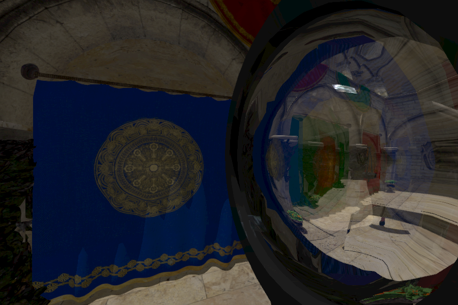

# CPU Raytracer


Implementation of a Whitted-Style CPU Raytracer.
The project uses multithreading, a high quality acceleration structure ([SBVH](https://www.nvidia.com/docs/IO/77714/sbvh.pdf)), SIMD vectors, and data-oriented design to achieve high frame rates on modest CPU's, even in scenes with large triangle counts.

## Features

### BVH


*The BVH for each individual objects is a high-quality SBVH (traversed in object space) and they are conmbined using a regular top-level BVH (traversed in world space). The two blue tori are instances of the same mesh and can therefore share the same underlying mesh data and SBVH.*

- Supports standard BVH's, constructed using the Surface Area Heuristic
- Supports SBVH's, which add the possibility for spatial splits, thereby improving performance in scenes with a non-uniform Triangle distribution.
- A Top Level BVH is constructed at the Scene Graph level. This structure is rebuild every frame, allowing different objects to move or rotate throughout the scene.

### Realtime

- Multiple SIMD lane sizes are supported, including 1 (no SIMD, plain floats/ints), 4 (SSE), and 8 (AVX). The SIMD lane size can be configured by changing the ```SIMD_LANE_SIZE``` define in Config.h. This affects the whole program.
- Packet Traversal. Rays are traversed using SIMD packets. This amortizes memory latencies over multiple Rays. For example, switching from a SIMD lane size of 1 to 4 yields a speedup of over 10x due to cache effects.
- Multithreading. The renderer uses all available hardware threads. 
Each logical core gets assigned a Worker Thread and uses work stealing (among the other threads) by atomically requesting the next tile to render. This continues until all tiles are rendered.

### Mipmapping


*Mipmapping works correctly even when Rays are reflected or refracted.*

- Mipmapping is implemented to combat texture aliasing.
- The MipMap LOD is determined using Ray Differentials, as described in Igehy 99 and Ray Tracing Gems chapter 20.
- Mipmapping works correctly for reflected and refracted rays.
- Three filtering modes are supported for mipmaps: Trilinear, Anisotropic and Elliptical Weighted Average. You can switch between them by changing the ```MIPMAP_FILTER``` define in Config.h. 
  - Trilinear filtering is isotropic and looks blurry at oblique viewing angles. 
  - Anisotropic filtering is based on the OpenGL specification of an anisotropic filter. (see [the extension specification](https://www.khronos.org/registry/OpenGL/extensions/EXT/EXT_texture_filter_anisotropic.txt) for more details.
  - Elliptical Weighted Average filtering is also an anisotropic filter, but provides better quality at the cost of being more expensive.

*Note: For now only Textures with a width and height that are both powers of two support Mipmapping! The width and height do not have to be equal, allowing non-square Textures.*

### Other



- Plane, Sphere, and Triangle Mesh primitives. All primitives support Ray Differentials.
- Diffuse, specular/mirror, and dielectric materials.
- Point Lights, Spot Lights, and Directional Lights that can all cast shadows.
- FXAA is used for anti-aliasing.

## Usage

The camera can be moved using the WASD keys and oriented using the arrow keys. Vertical movement of the camera is done using the shift and spacebar keys.

Various options and settings are available in Config.h.

When running for the first time the SBVH needs to be constructed, this may take around 10 seconds for the Sponza scene. The BVH is stored to disk so that on later runs the program loads fast.

## Dependencies

The project uses SDL and GLEW. Their dll's for both x86 and x64 targets are included in the repositories, as well as all required headers.

Additionally, the project uses the stb_image and tinyobjloader header-only libraries. These headers are included in the repository.

Finally, the project requires Intel's Small Vector Math library (SVML). This library is included with Visual Studio 2019, other compilers will need to link against SVML. Instructions for linking against SVML can be found in section 8.5 of [Agner Fog's VCL manual](https://www.agner.org/optimize/vcl_manual.pdf).

## Obj Scenes Credits

- Models downloaded from Morgan McGuire's [Computer Graphics Archive](https://casual-effects.com/data)
- [Small Tropcial Island](https://www.turbosquid.com/3d-models/free-island-3d-model/794972) by Herminio Nieves
